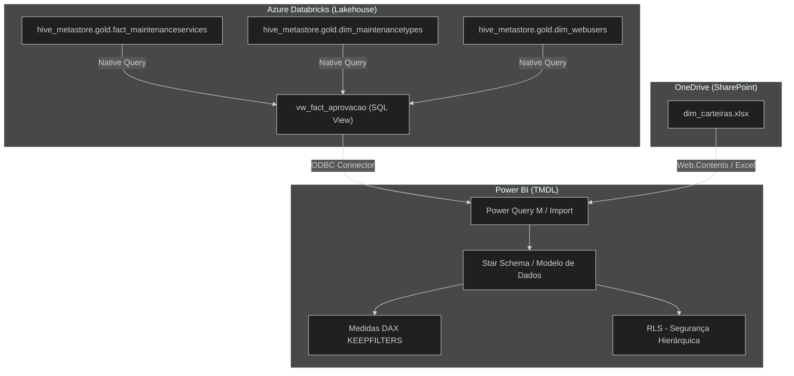

# 📊 Painel de Produtividade Operação — Edenred

| Corporate Analytics Solution | *Databricks Apps Integration & OneDrive*

Aplicação de *Business Intelligence* focada em analisar e otimizar a performance dos aprovadores de ordens de serviço (OS) no processo de manutenção de frotas da Edenred. O painel fornece visibilidade em tempo real sobre a velocidade de aprovação e garante a manutenção do SLA acordado, combinando grandes volumes de dados operacionais (Lakehouse) com matrizes de parametrização e segurança em planilhas na nuvem (OneDrive).

---

## 📋 Guia Executivo (Para Stakeholders e Analistas)

### O que o Painel faz?
Este é um **dashboard interativo** que monitora a performance da equipe de operações. Ele calcula quantas OSs são aprovadas por dia pelos consultores e coordenadores, aplicando pesos diferentes baseados no tipo de manutenção, dificuldade, interações necessárias e SLA.

### Funcionalidades Disponíveis

| Funcionalidade | O que faz | Onde encontrar |
|---|---|---|
| **Dashboard Principal** | Mostra os indicadores-chave (SLA, Dias Úteis Trabalhados, Produtividade). | Página inicial |
| **Análise de Aprovadores** | Detalha a média diária de OSs concluídas por consultor e supervisor. | Aba Analítica |
| **Auditoria e Glosas** | Cruza dados operacionais com indicadores financeiros de glosas. | Aba Auditoria |

### Glossário de Termos
- **SLA de Aprovação:** Tempo em horas úteis garantido em contrato para a devolução e aceite de uma Manutenção.
- **Peso OS:** Multiplicador que equipara OSs fáceis e difíceis para avaliar a performance com equidade.
- **Interação (Revisão/Cotação):** Ações adicionais necessárias pelo analista junto ao parceiro/oficina, que somam "tempos extras" à meta.
- **Monta (Alta/Baixa/Média):** Classificação de severidade e valor de uma OS aprovada.

### Fluxo de Uso
1. O analista acessa o painel filtrando sua **Carteira** ou **Supervisor**.
2. Filtra dinamicamente os **Períodos (Semana/Mês)** para verificação de batimento de meta.
3. Observa os cards de **Eficiência de SLA** para agir rápido em gargalos.

---

## 💻 Documentação Técnica (Para Engenheiros e Devs)

### Documentação Técnica (Fluxograma)



### Stack Tecnológico
- **Cloud/Data Platform:** Azure Databricks (Unity Catalog, Spark SQL).
- **Apoio de Parametrização:** OneDrive / Excel Sharepoint.
- **Frontend / BI:** Microsoft Power BI Desktop & Service.
- **Modelagem:** TMDL (Tabular Model Definition Language).
- **Linguagens:** SQL, DAX, Power Query (M).

### Estrutura de Diretórios
```text
/Produtividade Operação.SemanticModel
 ├── /definition
 │    ├── /tables/ (Arquivos TMDL dimensionais e fatos)
 │    ├── /roles/ (Filtros de Segurança RLS)
 │    ├── model.tmdl (Definição principal)
 │    └── relationships.tmdl (Ligações do Modelo)
/vw_fact_aprovacao.sql (Script de View DDL para o Databricks)
/README.md
```

### Catálogo de Tabelas
| Tabela | Origem | Tipo | Descrição |
|---|---|---|---|
| `FactAprovacao` | Databricks | Fato | Fato central agregando requisições de OS, timestamps e pesos. (Via SQL View). |
| `FactAuditoria` | Databricks | Fato | Fato de compliance das notas de atendimento e serviço. |
| `DimCalendario` | DAX | Dimensão | Tabela de dDates com mapeamento dinâmico de Feriados e Finais de Semana. |
| `dim_consultores` | OneDrive | Dimensão | Parametrização importada do Excel: Mapeamento 1:1 de consultores e chaves de e-mail (Vital para Segurança RLS). |
| `dim_supervisores` | OneDrive | Dimensão | Parametrização importada do Excel: Tabela de rollup hierárquico da gestão operacional (Carteiras e Coordenadores). |
| `dim_metas` | OneDrive | Dimensão | Alvos de SLA e métricas-chave por clientes. |

### Colunas Críticas e Importância do OneDrive
Apesar dos dados transacionais massivos residirem no Databricks, **as planilhas do OneDrive ditam ativamente as regras de negócio organizacionais**. 
- **A Influência do Excel:** A tabela `dim_carteiras.xlsx` fornece os e-mails para identificação corporativa do `USERNAME()` nas funções DAX. Sem isto, a segurança de nível de linha em cascata (RLS) colapsa, exibindo dados de gestores divergentes ou bloqueando totalmente o painel para um usuário válido. Além disso, as metas de SLA na pasta `dim_metas` afetam crucialmente todas as `Measures` que calculam se a OS foi tempestiva de fato ou não.
- `FactAprovacao[peso_os]`: Coluna essencial (SQL Nativo), serve de multiplicador da produtividade.
- `FactAprovacao[data_aprovacao]`: Data base convertida para `DATE` removendo horários e aprimorando compressão VertiPaq.

### Regras de Negócios
* O painel foca na taxa de eficiência em **Dias Úteis**. Dias de fim de semana são contados ou pulados dinamicamente via filtros de dias trabalhados (`Sábado = Sim/Não`) mapeados na planilha da estrutura do OneDrive (Aprovadores).
* OSs "Automáticas" (`IsAutomaticApproval = TRUE`) são sumariamente excluídas para não inflar a produtividade real humana.
* **Preço Parceiro:** Lojas não-concessionárias recebem fator de correção positivo ou negativo na performance.

### Gráficos e Visualizações
* Gráficos de barra empilhada detalhando `Ticket Médio x Total Valor Aprovado`.
* Matrizes de `Aderência` usando _Conditional Formatting_ com base no range SLA vs Executado.

### Fluxo de Sincronização de Dados
1. Origem Primária: Datalake (`hive_metastore.bronze` -> `gold`) atualizado via Databricks Workflows.
2. Origem Secundária: Arquivos do Excel (OneDrive) atualizados ativamente pela operação de Gestão de Frota.
3. Ingestão: Power BI Service através de Agendamento (Scheduled Refresh - Diário).

### ⚠️ Notas Adicionais e Arquitetura de Sustentação Recomendada
* **Alerta de Governança (Data Mesh):** Trabalhar com dados parametrizadores estruturais (Segurança de Hierarquia Corporativa, Metas Regionais e Regras Trabalhistas como Dias de Sábado) vinculados em planilhas *.xlsx* descentralizadas no OneDrive sob custódia humana (`dim_carteiras.xlsx`) **não é a prática recomendada de arquitetura para a sustentação analítica de longo prazo**. 
* **Riscos Latentes:** Planilhas hospedadas sobem imensamente a taxa de quebra de atualização automatizada do BI (Scheduled Refreshes), por serem fontes extremamente suscetíveis a manipulações e instabilidades, tais como exclusão acidental, colunas renomeadas, conversão errada de tipagem e locks de edição concorrente por membros da operação.
* **O Modelo Lakehouse Ideal:** O estágio técnico maduro para este painel é **migrar e centralizar** a matriz de hierarquia da equipe, metas por carteira e regras do RLS para dentro do **LAKEHOUSE (Databricks)** como tabelas dimensionais controladas (View/Silver Area). Isso extirpa a dependência do SharePoint, garante integridade relacional via metadados rastreáveis _end-to-end_ e permite consolidar o *Query Folding* com um conector Cloud limpo. Com isso, o arquivo `Produtividade Operação` passaria a servir puramente como a *Camada Semântica*, sem ter que aplicar lógicas custosas unindo sistemas distantes via M (Power Query).

### Segurança e Governança
Este modelo utiliza **RLS Dinâmico (Row-Level Security) em Cascata**:
* `[Role: Administradores]`: Visualização total de carteiras.
* `[Role: Supervisores]`: Tabela `dim_supervisores` filtra automaticamente e propaga a leitura somente para `Consultores` e suas `Aprovações` atreladas ao seu e-mail do sistema.
* Nível de confidencialidade dos Dados: **Organizacional (Sensível)**. Requer conector unificado Databricks x Entra ID.

---
© 2025–2026 Edenred — Todos os direitos reservados.
Desenvolvido pela equipe de Entrega de Resultados — Dados.
